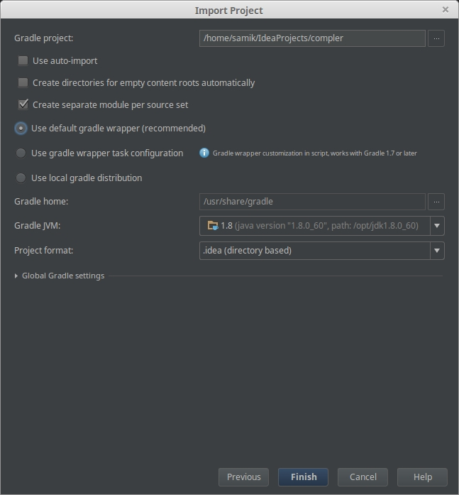
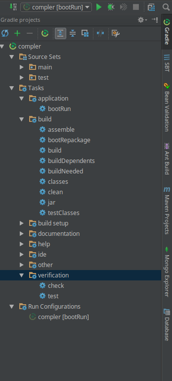
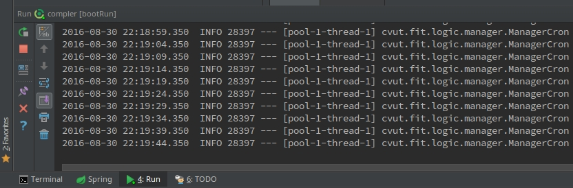

# Compler - Programátorská příručka

### Java - základní pojmy

Java je multiplatformní, objektově orientovaný programovací jazyk. Přenositelnost je zajištěna tím, že zdrojový kód (*\*.java*) je kompilován do bajtkódu (*\*.class*).
Na konkrétní platformě běží virtuální stroj, který interpretuje bajtkód do strojového kódu specifického pro danou platformu.

**JVM** (Java Virtual Machine) - interpret bajtkódu
**JRE** (Java Runtime Environment) - obsahuje JVM a další soubory nutné ke spuštění java aplikace (knihovny)
**JDK** (Java Development Kit) - obsahuje JRE a nástroje potřebné pro vývoj (kompilátor)


### Gradle
#### Automatizované operace
Nástroj díky kterémů můžeme automatizovat operace nad projektem. Podobně jako Git je Gradle snadno ovladatelný z příkazové řádky.

Například:
**Buildování** - kompilace + sestavení JAR/WAR souboru

`gradle assemble` - buildování
`gradle build` - před buildováním spustí testy

**Testování** - spuštění testů (například jednotkových)

`gradle test` - spuštění všech testů

**Cleanování** - odstranění zkompilovaných souborů

`gradle clean`

**Javadoc** - vygenerování dokumentace

`gradle javadoc`


####build.gradle
Jedná se o základní konfigurační soubor Gradlu. Nachází se v rootu našeho projektu.

Náš build script vypadá v základu následovně:

```groovy
buildscript {
	ext {
		springBootVersion = '1.4.0.RELEASE'
	}
	repositories {
		mavenCentral()
	}
	dependencies {
		classpath("org.springframework.boot:spring-boot-gradle-plugin:${springBootVersion}")
	}
}
```
*V části buildScript je kofigurace pro samotný Gradle.*

```groovy
apply plugin: 'java'
apply plugin: 'spring-boot'
apply plugin:  'idea'
```

*Aplikování pluginů (viz níže).*


```groovy
jar {
	baseName = 'compler'
	version = '0.0.1-SNAPSHOT'
}
sourceCompatibility = 1.8
targetCompatibility = 1.8
```

*Parametry vygenerovaného JAR filu a proměnné určující s jakou verzí Javy je projekt kompatibilní.*

```groovy
repositories {
	mavenCentral()
}
```

*Centrální repozitáře, z kterých se stahují závislosti. Můžeme to chápat jako URL.*


```groovy
dependencies {
	compile('org.springframework.boot:spring-boot-starter')
	compile("org.springframework:spring-web")
	compile("org.springframework.boot:spring-boot-starter-thymeleaf")
	testCompile('org.springframework.boot:spring-boot-starter-test')
}
```

*Definice závislostí (viz níže).*


####Správa závislostí

V podstatě každý projekt je závislý na externích knihovnách. Proč bychom například psali vlastní JDBC driver? Obecně je velkou výhodou Javy její ohromný ekosystém.
Existují tisíte knihoven a je tedy dost pravděpodobné, že pokud nepotřebujeme nějak zvlášť atypickou funkcionalitu, někdo ji už napsal.
V dřevních dobách bylo nutné stahovat JAR soubory (knihovny) a ručně je přidávat do projektu. Takový postup moc dobrý není a přináší s sebou spoustu problémů jako například správa verzí daných knihoven.
Gradle zachoval konvence Mavenu. 
Každý projekt je jednoznačně identifikován skupinou (group), jménem (name) a verzí (version\). 

Přidání závislost build.gradle vypadá následovně:

```groovy
dependencies {
    compile group: 'org.hibernate', name: 'hibernate-core', version: '3.6.7.Final'
 }
```

Zápis může být zkrácen do formátu "group: name: version".


```groovy
dependencies {
    compile 'org.hibernate:hibernate-core:3.6.7.Final'
 }`
```

#### Životní cyklus aplikace
Aplikace se během vývoje nachází v různých stavech. Například fáze kompilace je jiná než fáze testováná. Množinu těchto fází nazýváme Životním cyklem (Life cycle). 
Fáze životního cyklu je důležitá právě pro závislosti. Slovo před popisem závislosti nám říká, v jaké fázi je závislo potřeba. Fáze jsou následující:

* **Compile (compile)** - závislot je vyžadována při kompilaci
* **Runtime (runtime)** - závislot je vyžadována za běhu aplikace
* **Test Compile (testCompile)** - závislost je vyžadována při kompilaci testů
* **Test Runtime (testRuntime)** - závislost je vyžadována za běhu testů

#### Tasky a pluginy
**Task** je operace nad projektem. Například kompilace nebo buildování jsou tasky. Gradle nám umožňuje definovat vlastní tasky a závislosti mezi nimi. Můžeme tedy například napsat task, který nám vytvoří požadovanou adresářovou strukturu.
Množina tasků se nazývá **plugin**. Napříkal java plugin nám zajistí standardní tasky potřebné pro vývoj nad Javou (kompilace, clean, javadoc, ...)
My používáme plugin spring-boot, díky němuž můžeme použít task bootRun.

### Zprovoznění projektu v IntelliJ IDEA

1) Projekt si naklonujeme do aktuálního adresáře:

`git clone https://github.com/buttasam/compler.git`

2) V IntelliJ IDEA zvolíme  File | New | Project from Existing Sources


3) V okně wizadru vybereme Gradle a klikneme na Next

4) V okně Import Project zvolíme možnosti podle obrázku


Gradle home pro nás není podstatný, protože používáme Gradle Wrapper. Tedy binárku (JAR file) Gradlu máme přímo v projektu.
Gradle JVM je cesta k JDK. Použijeme nejnovější stabilní verzi.

5) IDEA bude chvíli projekt nahrávat. Poté se nám v levém Project panelu objeví struktura projektu.

6) Doporučený postup je použít Gradle panel vpravo (viz obrázek). Projekt spustíme dvojím kliknutím na task bootRun ve složce task/application.
   Z terminálu lze projekt spustit příkazem:
`./gradlew bootRun`



7) Dole v záložce Run bychom měli vidět výpis logu.
   Výpis konzole má dva módy - grafický a textový. Žádoucí je textový mód, na který se přepneme ikonkou v pravo nahoře. (viz obrázek)



8) Zapneme podporu pro Git. V IDEA zvolíme VCS | Enable Version Control Integration a vybereme Git


### Struktura projektu
Struktura pojektu se řídí standardní Gradlovskou konvencí.

```
    +--.gradle = pomocné soubory Gradlu
    +--.idea = pomocné soubory IDEA
    +--build
    +--doc (dodatečně přidáno) = dokumentační soubory a obrázky
    +--gradle = binárka Gradle wrapperu
    +---src = zrojové kódy
    |  +--main
    |  |  +--java
    |  |  +--resources
    |  +--test
    |  |  +--java
    |  |  +--resources
    
```

## Spring

Spring je Javovský framework pro tvorbu Enterprise (rozumějme rozsáhlých) aplikací.

Proč framework?
* Nemusíme znovu objevovat kolo a můžeme se soustředit na unikátnost naší aplikace.
* Framework se stará o spoustu věcí za nás. (Security, DI)
* Framework je vyvíjen komunitou, vývoj vlastního frameworku je velmi nákladný.

### Spring Boot
Konfigurace Java aplikací je relativně náročná. Starší projekty si zpravidla s sebou nesou různé konfigurační XML soubory. 
Moderní způsob konfigurace je pomocí anotovaných tříd. Konfigurace přesto zůstává složitá. Proto vznikl Spring boot.
Jedná se sadu nástrojů (například anotací), která nám dovolí postavit samostatně běžící aplikaci s minimální konfigurací.

Proč Spring Boot?
* vytvoří samostatně běžící aplikaci
* automaticky přidá k našemu projektu aplikační server (Tomcat, Jetty nebo Undertow), není tedy třeba deploy WAR souboru
* automaticky konfiguruje Spring, ale nechává možnost jakékoliv výchozí nastavení změnit
* není potřeba generování žádného kódu nebo externích XML souborů

### Základní popis kódu

###Jak psát

### Dependency injection

### Komponenty a služby

### Přidání knihovny

## Databáze

#### ORM
#### Entity
#### Repozitáře
